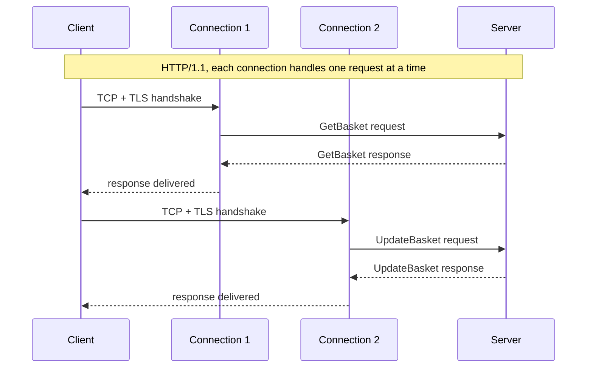
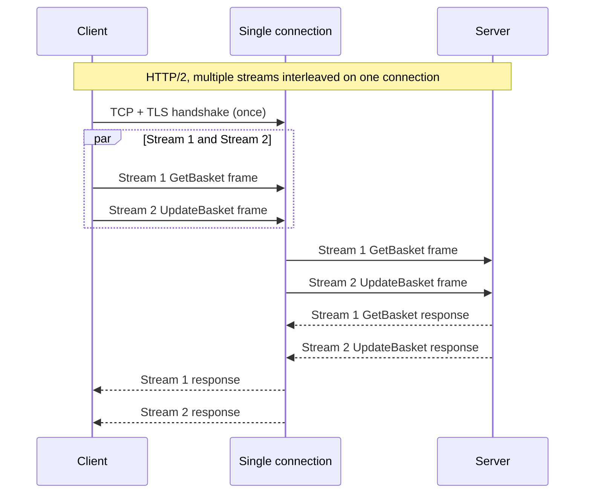
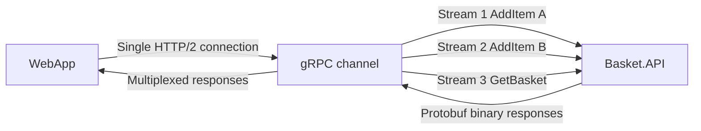
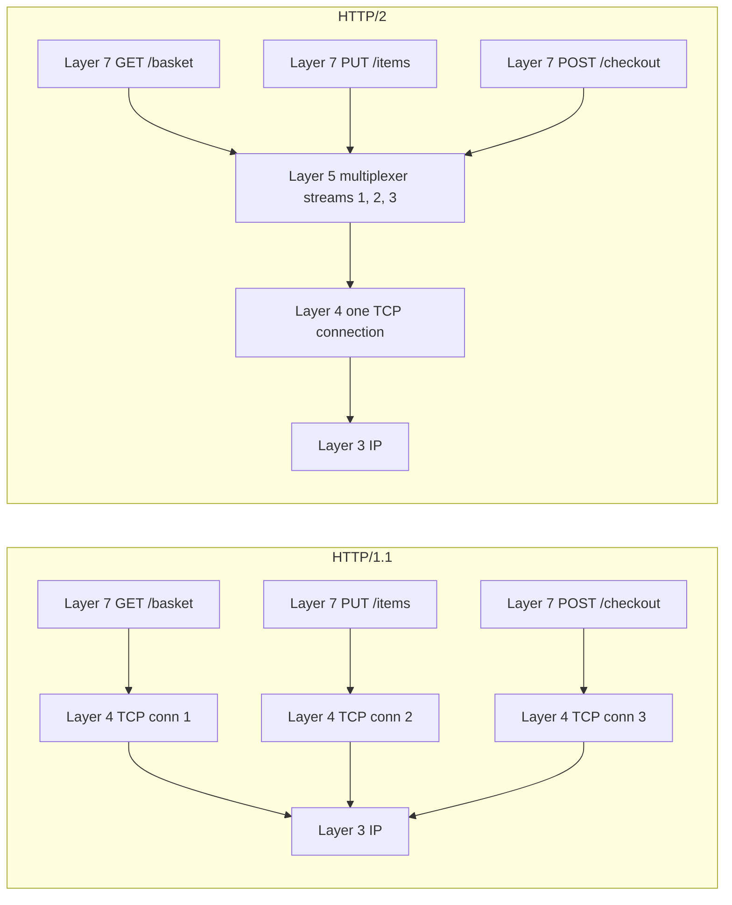

An HTTP/1.1 connection carries one request at a time. The client sends a request, waits for the response, and only then can it send the next one.

## What HTTP/2 does

HTTP/2 splits every message into small binary chunks called frames. Each frame carries a stream identifier. A request and its response live on the same stream. Frames from different streams travel down the same TCP connection, interleaved in whatever order is convenient. The receiver puts them back together by stream ID.

At the TCP layer nothing changed. The socket still carries one ordered byte stream. The HTTP/2 endpoints impose structure on top of that byte stream by tagging each frame with a stream ID, then scheduling frames from different requests onto the same connection. The peer reconstructs each logical request-response exchange by collecting frames with the same identifier.

The result is that two requests no longer block each other. A slow response on stream 1 does not stop stream 2 from delivering its frames. There is no head-of-line blocking at the HTTP layer. There is no need to open six connections to get six things in parallel.

## An example

Consider a shopping cart service. The web app talks to it constantly. Every click that adds, removes, or views an item is a separate request. With HTTP/1.1 over a single connection, those requests serialize. The user clicks twice in quick succession and the second request waits for the first to come back. With six connections, the browser can fan them out, but each new connection still pays for its handshakes the first time it is used.

With HTTP/2, the same connection carries both requests at once. Stream 1 sends the add. Stream 2 sends the remove. The frames interleave on the wire. The server processes them in parallel and sends responses back on the same two streams. The user's clicks feel instant because nothing waited for anything else.

If the cart service speaks gRPC instead of REST, the payloads are also smaller. Protobuf encodes a typical message in a fraction of the bytes that JSON would use. Smaller frames, fewer of them, all on one connection.

## Where multiplexing lives in the stack

The OSI model gives us seven layers. Physical at the bottom, Application at the top. HTTP sits at layer seven. TCP sits at layer four. The interesting thing about HTTP/2 multiplexing is that it lives between them, in a place that did not really exist before.

Here are the layers that matter for this story:

| Layer | Name         | What it handles                                  |
| ----- | ------------ | ------------------------------------------------ |
| 7     | Application  | HTTP semantics, gRPC method calls                |
| 6     | Presentation | TLS encryption, JSON or Protobuf serialization   |
| 5     | Session      | HTTP/2 binary framing and stream management      |
| 4     | Transport    | TCP, which delivers a reliable stream of bytes   |
| 3     | Network      | IP, which routes packets between hosts           |

### Layer 4 sees one byte stream

TCP has no idea that HTTP/2 streams exist. It does what it has always done: deliver a reliable, ordered stream of bytes from one endpoint to another. The kernel's TCP implementation is the same whether the bytes flowing through it are an HTTP/1.1 request, an HTTP/2 frame, or a file download.

This is good and bad. Good because HTTP/2 needs no kernel changes to work. Bad because TCP's notion of "reliable, ordered" applies to the whole byte stream. If one packet is lost, TCP holds back every byte that came after it until the lost packet is retransmitted and reassembled. If those held-back bytes belonged to three different HTTP/2 streams, all three streams stall, even though only one of them was waiting for the missing data. This is TCP-level head-of-line blocking, and HTTP/2 does not solve it. HTTP/3 does, by replacing TCP with QUIC, which understands streams natively. That is a different post.

### Layer 5 is where the trick lives

Above TCP, HTTP/2 inserts its own framing layer. Every message is broken into frames. A HEADERS frame carries the request line and headers. A DATA frame carries the body. Each frame has a stream identifier, a length, and a type. The framing layer interleaves frames from different streams onto the TCP byte stream and reassembles them on the other side.

This layer also handles header compression with an algorithm called HPACK, which keeps a small dictionary of headers seen on the connection so far. Common headers like `:method` and `user-agent` get compressed to a byte or two on the wire instead of repeating in full on every request.

If you want to point at one place and say "this is what HTTP/2 added," this is the place. The framing layer at session scope is the entire innovation.

### Layer 6 quietly benefits

TLS lives here, and one TLS handshake costs the same whether the connection that follows carries one request or a thousand. With HTTP/1.1 and six connections, the browser pays for six handshakes. With HTTP/2 and one connection, it pays for one. The savings are real on slow networks and high-latency links, where each round trip costs tens or hundreds of milliseconds.

Serialization is also a layer 6 concern. JSON is text. Protobuf is binary. The framing layer below them does not care which one rides on top, but the wire is shorter when it is Protobuf, and gRPC takes that benefit and adds code generation and typed contracts on top.

### Layer 7 stays familiar

The application code does not change much. A REST handler still sees a request and writes a response. A gRPC service still implements methods. The fact that those requests and responses are now riding on multiplexed streams over a shared connection is invisible to the application logic, which is exactly how layered protocols are supposed to work.

## When the upgrade actually pays off

The biggest wins come in three places. First, any service called many times in quick succession from the same client benefits, because the per-request overhead drops to almost nothing. A backend-for-frontend API serving a chatty single-page app is a good fit. So is a microservice mesh where one service calls several others in a fan-out pattern.

Second, anything that paid a lot of TLS handshake cost gets that money back. Mobile clients on cellular networks, where round-trip times are high, see the largest improvement.

Third, gRPC services get HTTP/2 as a hard requirement, and with it the ability to do bidirectional streaming on a single connection. Server-streaming RPCs, client-streaming RPCs, and full duplex streams are all just multiple stream IDs flowing through the same framing layer. This is impossible to do cleanly with HTTP/1.1.

## TCP slow start and why it matters for connection count

Every new TCP connection begins with a congestion window (`cwnd`) of 10 segments, typically around 14 KB. The sender can put that much data in flight before it needs acknowledgements. As acknowledgements arrive, `cwnd` grows: doubling each round trip during slow start, then growing linearly once it hits the slow-start threshold. On a high-latency link, a cold connection reaching its full throughput can take several round trips. On a transatlantic link with 150 ms RTT, that is seconds.

HTTP/1.1 opens six connections. Each one starts its own slow-start climb. Those six windows compete for the same bottleneck link. The browser gets burst parallelism but pays the slow-start tax six times, and each connection competes with the others for bandwidth.

HTTP/2 opens one connection. It climbs slow start once. After that, the full window is available for all concurrent streams. On a warm connection that has been used recently, the window is already large, and every subsequent burst of requests travels at full speed. This is why the TLS and TCP consolidation matters beyond just saving handshake round trips.

## Stream prioritization and why it was abandoned

HTTP/2 included a stream prioritization system. Clients could assign weights and declare dependencies between streams, forming a tree that servers could use to schedule responses in the order most useful for page rendering. It was a reasonable idea that failed on contact with real implementations. Servers interpreted the tree differently, intermediaries ignored or corrupted the signals, and the algorithm was underspecified enough that interoperability was never achieved. [RFC 9113, Section 5.3.2](https://www.rfc-editor.org/rfc/rfc9113.html#section-5.3.2) deprecated the entire scheme in 2022.

[RFC 9218](https://www.rfc-editor.org/rfc/rfc9218.html) defines the current replacement: an urgency-based priority scheme expressed as HTTP header fields. It is simpler to implement correctly and applies to HTTP/3.

## Server push: the feature that did not land

HTTP/2 allowed a server to proactively push resources before the client requested them. The practical problem was cache visibility. A server cannot know whether the client already has a resource, so it has no reliable way to avoid pushing things the client will discard. The extension meant to solve this (Cache-Digest) never shipped.

Server push is off by default in most configurations. The current approach is early hints (HTTP 103, standardized in [RFC 8297](https://www.rfc-editor.org/rfc/rfc8297.html)): a 103 response carries `Link: rel=preload` headers that let the browser start fetching sub-resources early, without the cache problem and without protocol-level machinery.

## Why gRPC fits HTTP/2 so well

gRPC is where HTTP/2 stops feeling like an incremental browser upgrade and starts looking like an application transport. Each RPC gets its own stream, so many calls can share one connection without the client opening a socket farm. That matters in service-to-service traffic where a process may keep dozens of calls in flight all the time.

Streaming is the second reason. Unary calls benefit from lower overhead, but server-streaming, client-streaming, and bidirectional streaming are the real payoff. Those interaction patterns are awkward on HTTP/1.1 and natural on HTTP/2 because the connection is already built to carry multiple long-lived logical exchanges at once; see the [gRPC core concepts guide](https://grpc.io/docs/what-is-grpc/core-concepts/).

This is also why teams sometimes overstate the role of Protobuf alone. Protobuf helps, but the larger shift is transport behavior: one warm connection, multiplexed streams, proper backpressure, and deadlines that can propagate cleanly across service hops.

## The shape of the change

HTTP/1.1 made a virtue of simplicity. One connection, one request at a time, plain text on the wire. You could telnet to port 80 and type a request by hand. HTTP/2 gave that up in exchange for a binary framing layer that lets one connection carry many concurrent exchanges. You can no longer type it by hand. In return, you stop paying for six TCP handshakes, six TLS handshakes, and six congestion windows climbing out of slow start.

The trade is worth it for almost any modern workload. The cost is that the protocol is no longer something you can read off the wire with `tcpdump` and a calm afternoon. The benefit is lower connection overhead and better concurrency for request-heavy systems.
