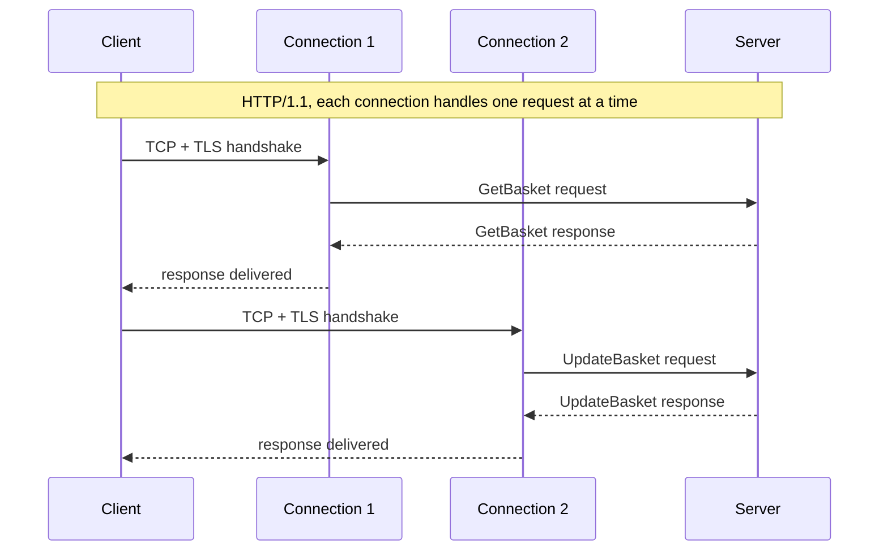
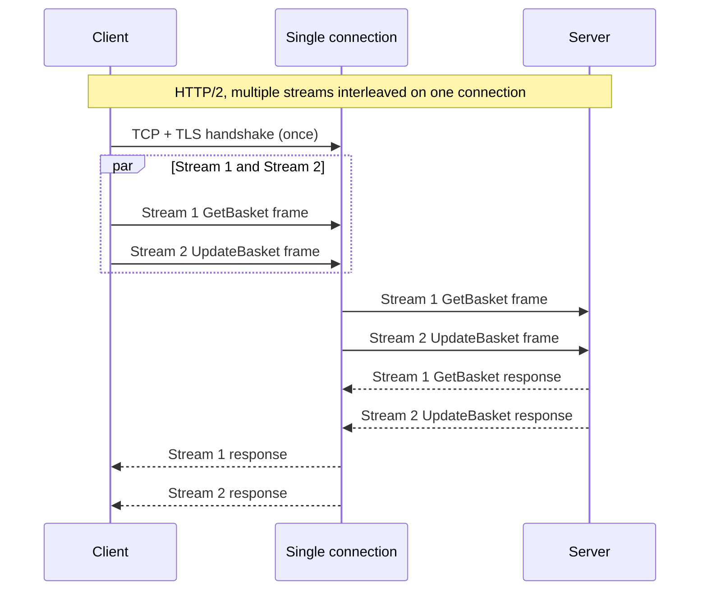
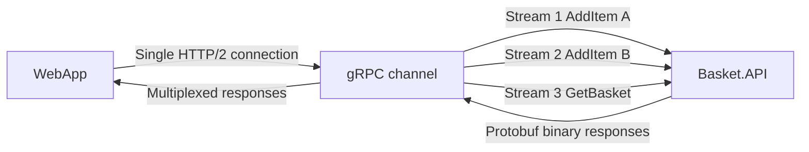
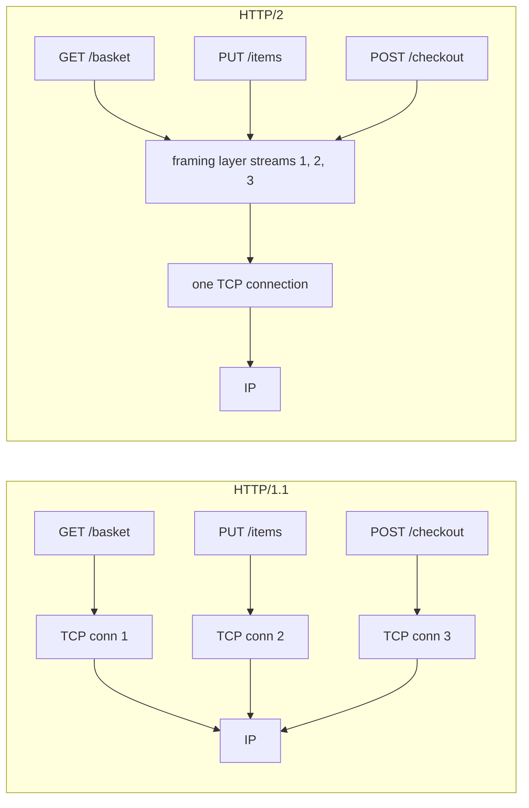

Open a web page and the browser fires off a pile of requests: the HTML first, then the CSS, the JavaScript, images, fonts, and whatever data the page fetches once it loads. Every one of those is a separate HTTP request. How they all travel over the network is the part that changed between HTTP/1.1 and HTTP/2, and that change is what this post is about.

In HTTP/1.1, a connection handles one request at a time. The browser sends a request, waits for the entire response to come back, and only then sends the next request on that connection. If a response is slow, everything lined up behind it waits for it to finish. Browsers work around this by opening several connections to the same server at once, usually up to six, so they can have six requests going in parallel. But six is the ceiling, and every new connection pays its own setup cost before it can carry anything.

## What HTTP/2 changed

HTTP/2 keeps one connection but lets it carry many requests at the same time. The trick has a name: multiplexing. It means taking several separate conversations and sending them over a single channel without letting them get tangled.

HTTP/2 pulls this off by chopping each request and each response into small pieces called frames. Every frame is stamped with a number that says which request it belongs to. One request, its response, and all the frames that make them up share the same number, and that numbered group is called a stream.

Because each frame carries its stream number, the connection can interleave frames from many streams, mixing them in whatever order is convenient, and the receiver sorts them back out by number. Stream 1's frames and stream 2's frames ride down the same wire interleaved, and each side rebuilds each request from the frames that share a number.

The payoff is that requests stop blocking each other. A slow response on stream 1 no longer holds up stream 2, because their frames are independent and can arrive in any order. The waiting that HTTP/1.1 forced on you, one response at a time per connection, is gone, and you no longer need six connections to fetch six things at once. One connection does it.

Underneath, the connection is still an ordinary one. HTTP/2 doesn't change the network plumbing. The splitting into frames and streams happens entirely inside the two programs talking to each other, the browser on one end and the server on the other.



## An example

Say you're building a shopping cart. The web app talks to a cart service constantly: every time someone adds an item, removes one, or opens the cart, that's a request. Over a single HTTP/1.1 connection those requests line up one behind the other. If a user clicks add twice quickly, the second request waits for the first to come back. Opening six connections lets the browser spread requests out, but each fresh connection still pays its setup cost the first time it's used.

Over HTTP/2, one connection carries both requests at once. The add goes out on stream 1, the remove on stream 2, their frames interleave on the wire, the server handles them in parallel, and the responses come back on the same two streams. To the user the clicks feel instant, because nothing sat waiting on anything else.

If the cart service uses gRPC instead of plain REST, there's a second saving. gRPC runs on HTTP/2 and encodes its messages with Protocol Buffers, a compact binary format, instead of JSON text. A message that would be a few hundred bytes of JSON shrinks to a fraction of that on the wire. So on top of sharing one connection, the messages themselves are smaller.

## Where multiplexing sits in the stack

It helps to see where this one change lives, because almost nothing else moves. Networking is built in layers, each one resting on the one below:

- IP gets packets from one machine to another.
- TCP turns those packets into a reliable, in-order stream of bytes, re-sending anything that gets lost.
- TLS encrypts that byte stream so nobody in the middle can read it.
- HTTP carries the actual requests and responses on top.

HTTP/2 slips one new layer in between TLS and HTTP: a framing layer that cuts messages into numbered frames and interleaves the streams. That is the whole of multiplexing. Everything above and below it works the way it always did.

### TCP still sees a single stream of bytes

TCP has no idea HTTP/2 streams exist. It does the one job it always did: deliver a reliable, in-order stream of bytes from one end to the other. It can't tell whether those bytes are an HTTP/1.1 request, a pile of interleaved HTTP/2 frames, or a file download, and it doesn't need to. That is why HTTP/2 could roll out without any changes to operating systems or network hardware. The kernel's TCP code is untouched.

The catch is that TCP's promise of in-order delivery covers the whole byte stream as one unit. If a single packet goes missing, TCP holds back every byte that arrived after it until the lost packet is re-sent and slotted into place. Now suppose those held-back bytes belonged to three different HTTP/2 streams. All three stall, even though only one of them was actually waiting on the missing data. This is head-of-line blocking, and HTTP/2 doesn't remove it; it just moved it down from the HTTP layer to the TCP layer. HTTP/3 finally removes it by dropping TCP for a newer transport called QUIC that understands streams itself, but that is its own subject.

### One TLS handshake instead of six

Before any encrypted data flows, the two sides do a TLS handshake to agree on keys. That handshake costs a round trip or two no matter how much data follows it, whether that is one request or a million. HTTP/1.1 with six connections does six handshakes. HTTP/2 with one connection does one. On a slow, high-latency link where each round trip costs tens or hundreds of milliseconds, doing that work once instead of six times is a real difference.

### The framing layer is the actual new thing

Everything above hangs on one addition: the framing layer that sits above TLS. It breaks every message into frames. A HEADERS frame carries the request line and the headers; a DATA frame carries the body. Each frame records its stream number, its length, and its type. The sending side interleaves frames from different streams onto the connection, and the receiving side reassembles them. This is the piece HTTP/2 added, and the rest of multiplexing falls out of it.

The framing layer also squeezes the headers with a scheme called HPACK. It keeps a small running table of the headers it has already seen on the connection, so a header like `:method` or a long `user-agent` string gets sent in full once and then referred to by a short code afterward, instead of repeating on every single request.

### The application doesn't notice any of this

A REST handler still receives a request and writes a response. A gRPC service still implements its methods. Neither one knows or cares that its requests and responses are now riding on interleaved streams over a shared connection. That is the point of building things in layers: the layer underneath can change completely as long as the contract above it stays the same.

The one choice the application does make is how to encode the body. JSON is text and Protocol Buffers is binary, so the same data is shorter over the wire as Protocol Buffers. The framing layer underneath carries either one without caring which, and gRPC builds on Protocol Buffers to add generated code and typed method signatures.

## When it actually helps

The benefit is largest wherever the same client talks to the same server a lot, because the per-request overhead drops close to zero once the connection is warm. A backend-for-frontend API serving a chatty single-page app fits this well. So does a mesh of microservices where one service calls several others to assemble a result.

Anything that was paying a lot of TLS handshake cost benefits too. Mobile clients on cellular networks, where round trips are slow, see the biggest improvement.

gRPC requires HTTP/2 outright, and in return it can stream messages in both directions over one connection: the server pushing a sequence of messages down, the client pushing a sequence up, or both at the same time. Those patterns are awkward to build on HTTP/1.1 and natural on HTTP/2, because the connection was made from the start to carry several long-running exchanges at once.

## Why a fresh connection starts slow

Saving handshakes isn't the only reason one connection beats six. There is a subtler cost in how TCP ramps up.

A brand-new TCP connection doesn't send at full speed. The sender starts cautiously, putting only about 14 KB of data on the wire before it pauses to hear that the data arrived. Each acknowledgement that comes back lets it send a little more, and during this warm-up the allowance roughly doubles every round trip. The warm-up is called slow start, and the running allowance, how much data the sender may have in flight at once, is the congestion window.

So a cold connection is slow until it has warmed up. On a fast local network you would never notice. On a link with a 150 ms round trip, like a phone reaching a server on another continent, climbing to full speed takes several round trips, and that can add up to seconds.

HTTP/1.1 opens six connections, so it runs that warm-up six separate times, and the six connections then compete with each other for the same limited bandwidth. HTTP/2 opens one. It warms up once, and from then on the full window is shared across every stream on it. If the connection was used recently it is already warm, so the next burst of requests leaves at full speed right away.

## The priority system nobody could agree on

HTTP/2 shipped with a way for the client to hint which responses mattered most. A client could assign weights to streams and declare that one stream depended on another, building a tree the server could use to decide what to send first. The point was to get the parts a page needs to render ahead of the rest.

It was a sensible idea that fell apart in practice. Different servers read the tree differently, equipment in the middle of the network ignored or mangled the hints, and the spec was vague enough that no two implementations ever really agreed. [RFC 9113, Section 5.3.2](https://www.rfc-editor.org/rfc/rfc9113.html#section-5.3.2) deprecated the whole scheme in 2022.

[RFC 9218](https://www.rfc-editor.org/rfc/rfc9218.html) defines the replacement: a simpler priority scheme based on an urgency value sent as an HTTP header. It is easier to get right, and it works for HTTP/3 too.

## Server push, and why it didn't last

HTTP/2 also let a server send a resource to the client before the client asked for it. The idea was to push, say, a stylesheet alongside the HTML that references it, instead of waiting for the browser to come back and request it in a second round trip.

The problem was the cache. The server has no reliable way to know what the client already has stored, so it can't tell whether it is saving a round trip or wasting bandwidth pushing something the browser will throw away. The extension meant to fix that, Cache-Digest, never shipped. Most servers turn push off by default now.

The approach that stuck is early hints, an HTTP 103 response defined in [RFC 8297](https://www.rfc-editor.org/rfc/rfc8297.html). The server sends a quick 103 carrying `Link: rel=preload` headers, which tell the browser to start fetching sub-resources early. The browser still decides what to fetch, so the cache problem disappears, and it needs no protocol-level machinery.

## Why gRPC fits HTTP/2 so well

gRPC is where HTTP/2 stops feeling like a browser optimization and starts looking like a general transport for services talking to each other. Each remote call gets its own stream, so a single process can keep dozens of calls in flight over one connection instead of opening a pile of sockets. In service-to-service traffic, where a process might always have many calls running, that matters a lot.

Plain request-response calls just get lower overhead. The real win is the streaming modes: a server sending a stream of messages back, a client sending a stream up, or a two-way stream where both happen at once. Those patterns are awkward on HTTP/1.1 and natural on HTTP/2, because the connection was designed from the start to carry several long-running exchanges at the same time. The [gRPC core concepts guide](https://grpc.io/docs/what-is-grpc/core-concepts/) goes into them.
