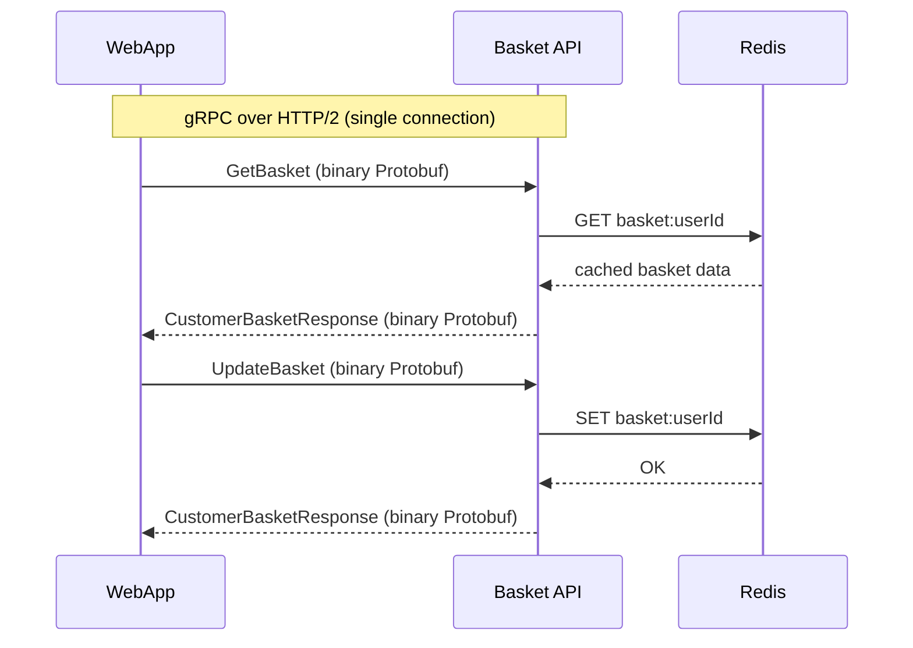
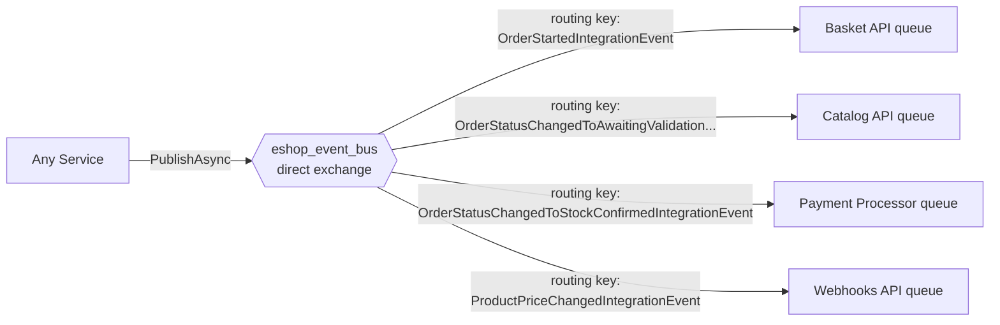
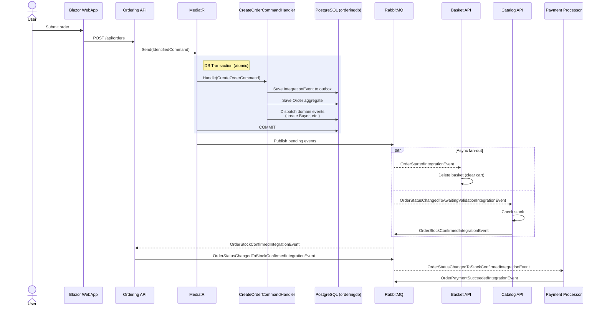

[eShop](https://github.com/dotnet/eShop) is Microsoft's reference e-commerce app for .NET, built as a set of small services instead of one big program. I went through it to work out which architecture patterns it uses and where.

---

## 1. .NET Aspire orchestration

Source: [`src/eShop.AppHost/Program.cs`](https://github.com/dotnet/eShop/blob/9b4f9434f46fdc5c1a6e9e936af2868340cdbc48/src/eShop.AppHost/Program.cs)

Aspire is the conductor. One file declares every bit of infrastructure and every service, and it wires them together:

```csharp
var redis = builder.AddRedis("redis");
var rabbitMq = builder.AddRabbitMQ("eventbus")
    .WithLifetime(ContainerLifetime.Persistent);
var postgres = builder.AddPostgres("postgres")
    .WithImage("ankane/pgvector")
    .WithImageTag("latest")
    .WithLifetime(ContainerLifetime.Persistent);

var catalogDb = postgres.AddDatabase("catalogdb");
var identityDb = postgres.AddDatabase("identitydb");
var orderDb = postgres.AddDatabase("orderingdb");
var webhooksDb = postgres.AddDatabase("webhooksdb");
```

Each service then states, in code, what it depends on:

```csharp
var basketApi = builder.AddProject<Projects.Basket_API>("basket-api")
    .WithReference(redis)                      // "basket-api needs Redis"
    .WithReference(rabbitMq).WaitFor(rabbitMq) // "...and RabbitMQ, wait for it"
    .WithEnvironment("Identity__Url", identityEndpoint);
```

From those few declarations, Aspire:

- Spins up the Redis, RabbitMQ, and PostgreSQL containers automatically

- Injects each service's connection strings as environment variables

- Enforces startup ordering (`.WaitFor(...)`)

- Enables service discovery, so services reference each other by name (`"basket-api"`, `"catalog-api"`)

- Provides a dashboard with health checks, logs, traces, and metrics

Each service also pulls in a shared set of defaults from [`src/eShop.ServiceDefaults/Extensions.cs`](https://github.com/dotnet/eShop/blob/9b4f9434f46fdc5c1a6e9e936af2868340cdbc48/src/eShop.ServiceDefaults/Extensions.cs). Most call `AddServiceDefaults()`, which switches on OpenTelemetry, health checks, resilient HTTP clients, and service discovery in one line. Basket.API and OrderProcessor call the lighter `AddBasicServiceDefaults()` instead (just OpenTelemetry and health checks), skipping the outgoing-HTTP resilience so Polly can be trimmed out of those two.




---

## 2. Three communication patterns

The services talk to each other in three different ways, and the choice is deliberate every time.

### Pattern A: synchronous HTTP REST (solid arrows)

This is for when a caller needs an answer right now: loading the product catalog, viewing order history.

```text
Browser → WebApp (Blazor) → HTTP GET → Catalog.API → PostgreSQL
```

The Ordering API ([`src/Ordering.API/Apis/OrdersApi.cs`](https://github.com/dotnet/eShop/blob/9b4f9434f46fdc5c1a6e9e936af2868340cdbc48/src/Ordering.API/Apis/OrdersApi.cs)) defines its endpoints with minimal APIs:

```csharp
var api = app.MapGroup("api/orders").HasApiVersion(1.0);
api.MapGet("{orderId:int}", GetOrderAsync);
api.MapPost("/", CreateOrderAsync);
```

### Pattern B: synchronous gRPC

This is for where speed matters most: the shopping cart. The Basket API uses gRPC instead of REST. gRPC lets one service call another's methods almost as if they were local, sending compact binary messages over HTTP/2 rather than JSON text over HTTP/1.1.

The server ([`src/Basket.API/Grpc/BasketService.cs`](https://github.com/dotnet/eShop/blob/9b4f9434f46fdc5c1a6e9e936af2868340cdbc48/src/Basket.API/Grpc/BasketService.cs)):

```csharp
public class BasketService(
    IBasketRepository repository,
    ILogger<BasketService> logger) : Basket.BasketBase  // generated from .proto file
{
    public override async Task<CustomerBasketResponse> GetBasket(
        GetBasketRequest request, ServerCallContext context)
    {
        var userId = context.GetUserIdentity();
        var data = await repository.GetBasketAsync(userId);  // reads from Redis
        return MapToCustomerBasketResponse(data);
    }
}
```

Cart operations happen constantly (add an item, remove an item), and gRPC fits that workload better than REST/JSON for three reasons:

1. Binary serialization (Protocol Buffers). REST sends human-readable JSON text (`{"productId": 42, "quantity": 1}`). gRPC sends the same data as compact binary bytes, following a schema written in a `.proto` file. The field names aren't sent at all, just field numbers and values, so the payload is generally smaller than the equivalent JSON. Less data means less time on the wire and less CPU spent parsing, though exactly how much smaller depends on the message.

2. HTTP/2 multiplexing. REST typically runs on HTTP/1.1, where each request-response holds a connection until it's done. If the WebApp wants to send "get basket" and "update basket" at the same time, HTTP/1.1 either queues them (head-of-line blocking) or opens a second TCP connection. HTTP/2, which gRPC requires, packs many requests onto a single TCP connection as interleaved binary frames. For a cart with rapid back-and-forth, that removes a lot of connection overhead.

3. Strongly-typed code generation. The [`.proto` schema file](https://github.com/dotnet/eShop/blob/9b4f9434f46fdc5c1a6e9e936af2868340cdbc48/src/Basket.API/Proto/basket.proto) generates both the C# server base class and the client stub at build time. There's no hand-written URL construction, no JSON serializer mismatch, and no runtime reflection. That isn't a speed advantage, but it deletes a whole class of serialization bugs.



gRPC is the wrong fit in a few common cases: when the client is a browser (gRPC-Web exists but adds complexity), when you want human-readable traffic for debugging (JSON is easier to eyeball), or when the API is public-facing (REST and OpenAPI have the better tooling ecosystem). The Catalog and Ordering APIs use REST for those reasons.

### Pattern C: asynchronous events via RabbitMQ

When something happens in one service that other services need to know about, the service it happened in publishes an integration event to RabbitMQ and moves on. It doesn't know or care who's listening. That's the whole point: the services stay decoupled, and you can add a new listener later without touching the publisher.

The base class ([`src/EventBus/Events/IntegrationEvent.cs`](https://github.com/dotnet/eShop/blob/9b4f9434f46fdc5c1a6e9e936af2868340cdbc48/src/EventBus/Events/IntegrationEvent.cs)):

```csharp
public record IntegrationEvent
{
    public Guid Id { get; set; }
    public DateTime CreationDate { get; set; }
}
```

The contract ([`src/EventBus/Abstractions/IEventBus.cs`](https://github.com/dotnet/eShop/blob/9b4f9434f46fdc5c1a6e9e936af2868340cdbc48/src/EventBus/Abstractions/IEventBus.cs)):

```csharp
public interface IEventBus
{
    Task PublishAsync(IntegrationEvent @event);
}
```

The implementation ([`src/EventBusRabbitMQ/RabbitMQEventBus.cs`](https://github.com/dotnet/eShop/blob/9b4f9434f46fdc5c1a6e9e936af2868340cdbc48/src/EventBusRabbitMQ/RabbitMQEventBus.cs)) publishes to a `direct` exchange named `eshop_event_bus`. A direct exchange routes each message to queues by an exact label called a routing key, and here the routing key is the event's type name, so a queue subscribes to the event types it cares about. It also threads OpenTelemetry tracing through, so you can follow one event across services.





---

## 3. Example: placing an order

Placing an order is where all three patterns show up at once. The full flow, then a step-by-step walk-through:



### Step 1: WebApp sends the command (HTTP)

The browser submits the order. The WebApp turns that into an HTTP POST to `Ordering.API /api/orders`. That's Pattern A: a plain synchronous request.

### Step 2: CQRS with MediatR

The endpoint wraps the request in a command object and hands it to MediatR, which routes the message to its registered handler. Sending requests as messages to dedicated handlers like this is the CQRS pattern: the commands that change things and the queries that read things travel separate paths instead of piling into one fat service class.

```csharp
var requestCreateOrder = new IdentifiedCommand<CreateOrderCommand, bool>(command, requestId);
var commandResult = await services.Mediator.Send(requestCreateOrder);
```

`IdentifiedCommand` is an idempotency wrapper. If the same `requestId` shows up twice, say a flaky network made the browser retry, the duplicate is quietly ignored instead of creating a second order.

### Step 3: the command handler builds the Order aggregate (DDD)

`CreateOrderCommandHandler` ([`src/Ordering.API/Application/Commands/CreateOrderCommandHandler.cs`](https://github.com/dotnet/eShop/blob/9b4f9434f46fdc5c1a6e9e936af2868340cdbc48/src/Ordering.API/Application/Commands/CreateOrderCommandHandler.cs)) builds the order. The `Order` here is a domain-driven-design aggregate: one object that owns a cluster of related data (the order, its line items, the shipping address) and is the only door through which that data can change. That's how the business rules end up enforced in one place rather than scattered across the codebase.

```csharp
public async Task<bool> Handle(CreateOrderCommand message, CancellationToken cancellationToken)
{
    // Queue an integration event to tell other services
    var orderStartedIntegrationEvent = new OrderStartedIntegrationEvent(message.UserId);
    await _orderingIntegrationEventService.AddAndSaveEventAsync(orderStartedIntegrationEvent);

    // Create the Order aggregate root (DDD)
    var address = new Address(message.Street, message.City, ...);
    var order = new Order(message.UserId, message.UserName, address, ...);

    foreach (var item in message.OrderItems)
        order.AddOrderItem(item.ProductId, item.ProductName, ...);

    _orderRepository.Add(order);
    return await _orderRepository.UnitOfWork.SaveEntitiesAsync(cancellationToken);
}
```

### Step 4: domain events fire inside the same process

When the `Order` is constructed it raises an `OrderStartedDomainEvent` (see the [`Order` aggregate root](https://github.com/dotnet/eShop/blob/9b4f9434f46fdc5c1a6e9e936af2868340cdbc48/src/Ordering.Domain/AggregatesModel/OrderAggregate/Order.cs)). After `SaveEntitiesAsync()`, MediatR hands these domain events to their handlers, all running inside the same process and the same DB transaction:

- [`ValidateOrAddBuyerAggregateWhenOrderStartedDomainEventHandler`](https://github.com/dotnet/eShop/blob/9b4f9434f46fdc5c1a6e9e936af2868340cdbc48/src/Ordering.API/Application/DomainEventHandlers/ValidateOrAddBuyerAggregateWhenOrderStartedDomainEventHandler.cs) validates or creates the Buyer

- [`OrderStatusChangedToAwaitingValidationDomainEventHandler`](https://github.com/dotnet/eShop/blob/9b4f9434f46fdc5c1a6e9e936af2868340cdbc48/src/Ordering.API/Application/DomainEventHandlers/OrderStatusChangedToAwaitingValidationDomainEventHandler.cs) queues an integration event for RabbitMQ via the outbox

Those are two different things that sound alike. Domain events stay inside one service (same process, same transaction); integration events cross between services (over RabbitMQ).

The outbox is what makes the crossing safe. You want to do two things together: save the order, and tell other services about it. If you saved to the database and then published to RabbitMQ as two separate steps, a crash in between would leave them disagreeing, an order with nobody told, or an announcement of an order that didn't save. So the integration events queued above are written into an outbox table in the same DB transaction as the order. [`TransactionBehavior`](https://github.com/dotnet/eShop/blob/9b4f9434f46fdc5c1a6e9e936af2868340cdbc48/src/Ordering.API/Application/Behaviors/TransactionBehavior.cs) commits that transaction and only then calls `PublishEventsThroughEventBusAsync(transactionId)` ([`OrderingIntegrationEventService`](https://github.com/dotnet/eShop/blob/9b4f9434f46fdc5c1a6e9e936af2868340cdbc48/src/Ordering.API/Application/IntegrationEvents/OrderingIntegrationEventService.cs)) to push them to RabbitMQ. An event is never published unless its order was durably saved first.

### Step 5: integration events fan out across services

`OrderStartedIntegrationEvent` reaches Basket.API over RabbitMQ ([`OrderStartedIntegrationEventHandler.cs`](https://github.com/dotnet/eShop/blob/9b4f9434f46fdc5c1a6e9e936af2868340cdbc48/src/Basket.API/IntegrationEvents/EventHandling/OrderStartedIntegrationEventHandler.cs)), which clears the cart now that the order exists:

```csharp
public async Task Handle(OrderStartedIntegrationEvent @event)
{
    await repository.DeleteBasketAsync(@event.UserId);  // clear the cart
}
```

`OrderStatusChangedToAwaitingValidationIntegrationEvent` reaches Catalog.API, which checks stock ([`OrderStatusChangedToAwaitingValidationIntegrationEventHandler.cs`](https://github.com/dotnet/eShop/blob/9b4f9434f46fdc5c1a6e9e936af2868340cdbc48/src/Catalog.API/IntegrationEvents/EventHandling/OrderStatusChangedToAwaitingValidationIntegrationEventHandler.cs)):

```csharp
foreach (var orderStockItem in @event.OrderStockItems)
{
    var catalogItem = catalogContext.CatalogItems.Find(orderStockItem.ProductId);
    var hasStock = catalogItem.AvailableStock >= orderStockItem.Units;
    confirmedOrderStockItems.Add(new ConfirmedOrderStockItem(catalogItem.Id, hasStock));
}

var confirmedIntegrationEvent = confirmedOrderStockItems.Any(c => !c.HasStock)
    ? new OrderStockRejectedIntegrationEvent(...)
    : new OrderStockConfirmedIntegrationEvent(...);
```

### Step 6: payment and shipping

`OrderStockConfirmedIntegrationEvent` comes back to Ordering.API, which moves the order to stock-confirmed and publishes `OrderStatusChangedToStockConfirmedIntegrationEvent`. PaymentProcessor subscribes to that one ([`OrderStatusChangedToStockConfirmedIntegrationEventHandler.cs`](https://github.com/dotnet/eShop/blob/9b4f9434f46fdc5c1a6e9e936af2868340cdbc48/src/PaymentProcessor/IntegrationEvents/EventHandling/OrderStatusChangedToStockConfirmedIntegrationEventHandler.cs)), takes the payment, and publishes `OrderPaymentSucceededIntegrationEvent` (or `OrderPaymentFailedIntegrationEvent`). Earlier in the flow, the [OrderProcessor](https://github.com/dotnet/eShop/blob/9b4f9434f46fdc5c1a6e9e936af2868340cdbc48/src/OrderProcessor/Services/GracePeriodManagerService.cs) background worker sits out a grace period after the order is submitted (a window for the customer to cancel), then publishes `GracePeriodConfirmedIntegrationEvent`, which moves the order to awaiting-validation and kicks off the stock check above.

The `OrderStatusChangedTo*` events are published by Ordering.API as the order's status advances, and they're what the other services subscribe to; the grace period before validation is driven by the OrderProcessor worker. The full chain:

```text
OrderStartedIntegrationEvent                            → Basket clears the cart
OrderStatusChangedToSubmittedIntegrationEvent           → WebApp shows the order as submitted
GracePeriodConfirmedIntegrationEvent                    → Ordering moves the order to AwaitingValidation
OrderStatusChangedToAwaitingValidationIntegrationEvent  → Catalog checks stock
OrderStockConfirmedIntegrationEvent                     → Ordering marks StockConfirmed
OrderStatusChangedToStockConfirmedIntegrationEvent      → PaymentProcessor charges
OrderPaymentSucceededIntegrationEvent                   → Ordering marks the order Paid
OrderStatusChangedToPaidIntegrationEvent                → Webhooks.API, WebApp, and Catalog react
```

Shipping is a separate, admin-triggered step. It raises `OrderStatusChangedToShippedIntegrationEvent`, which both Webhooks.API and the WebApp subscribe to, and the WebApp updates the order page in real time.

---

## 4. Summary of all patterns

| Pattern                    | Where                                                                                                                                                     | Why                                                            |
| :------------------------- | :-------------------------------------------------------------------------------------------------------------------------------------------------------- | :------------------------------------------------------------- |
| Aspire Orchestration       | [AppHost](https://github.com/dotnet/eShop/blob/9b4f9434f46fdc5c1a6e9e936af2868340cdbc48/src/eShop.AppHost/Program.cs)                                     | Automatic infra, service discovery, observability              |
| CQRS + MediatR             | [Ordering.API](https://github.com/dotnet/eShop/tree/9b4f9434f46fdc5c1a6e9e936af2868340cdbc48/src/Ordering.API/Application/Commands)                       | Separate read/write paths, behavior pipelines                  |
| DDD Aggregates             | [Ordering.Domain](https://github.com/dotnet/eShop/tree/9b4f9434f46fdc5c1a6e9e936af2868340cdbc48/src/Ordering.Domain/AggregatesModel/OrderAggregate)       | Business rules enforced through aggregate roots                |
| Domain Events              | [Within Ordering service](https://github.com/dotnet/eShop/tree/9b4f9434f46fdc5c1a6e9e936af2868340cdbc48/src/Ordering.API/Application/DomainEventHandlers) | Intra-service coordination (same transaction)                  |
| Integration Events         | [All services via RabbitMQ](https://github.com/dotnet/eShop/tree/9b4f9434f46fdc5c1a6e9e936af2868340cdbc48/src/EventBusRabbitMQ)                           | Inter-service coordination (async, decoupled)                  |
| Outbox Pattern             | [IntegrationEventLogEF](https://github.com/dotnet/eShop/tree/9b4f9434f46fdc5c1a6e9e936af2868340cdbc48/src/IntegrationEventLogEF)                          | Event saved in the order's transaction, published after commit |
| gRPC                       | [Basket.API](https://github.com/dotnet/eShop/blob/9b4f9434f46fdc5c1a6e9e936af2868340cdbc48/src/Basket.API/Grpc/BasketService.cs)                          | Binary, low-overhead communication                             |
| BFF (Backend-for-Frontend) | [Mobile BFF (YARP)](https://github.com/dotnet/eShop/blob/9b4f9434f46fdc5c1a6e9e936af2868340cdbc48/src/eShop.AppHost/Extensions.cs)                        | Tailored API surface for mobile clients                        |
| Database-per-Service       | All services                                                                                                                                              | Data isolation, independent deployability                      |
| Idempotent Commands        | [Ordering.API](https://github.com/dotnet/eShop/blob/9b4f9434f46fdc5c1a6e9e936af2868340cdbc48/src/Ordering.API/Apis/OrdersApi.cs)                          | Safe retries with `IdentifiedCommand`                          |
